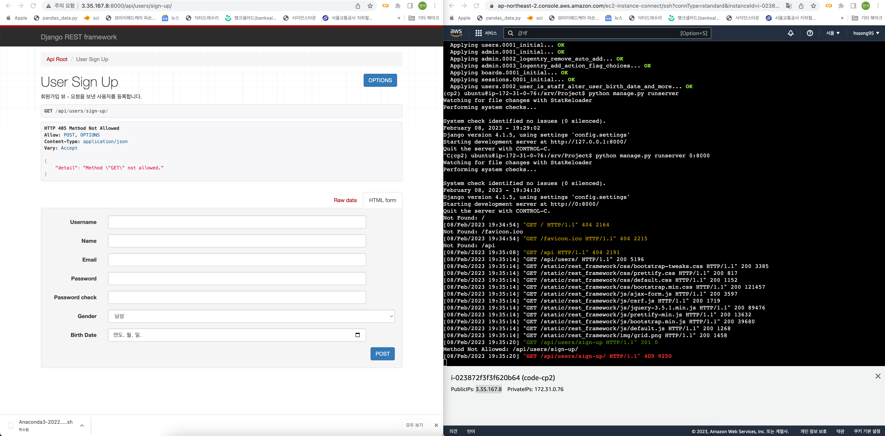

# REST API 백엔드 게시판

## 프로젝트 구조도

## 서비스 배포

AWS EC2 배포: 3.34.232.234:8000/

API doc:

<figure><figcaption></figcaption></figure>

## 서비스 목표

* Django REST Framework(DRF)를 활용한 백엔드 웹서비스 구축 및 배포
* 구축된 서비스를 통하여 발생하는 log를 활용 하기 위하여 추출,변환,적재(ETL)함
* 아마존 웹서비스 계열의 클라우드 서비스를 활용

## 서비스 기능

* 회원 기능
  * 회원 가입
  * 로그인
* 게시판 기능
  * 로그인시 게시판 글 작성 기능
  * 글 작성자만 글 수정 삭제 기능
* 통계
  * 회원
    * 성별
    * 나이대
  * 게시판
    * 성별
    * 나이대

## 활용 기술

* 백엔드 서비스
  * DRF
  * jwt 토큰화
  * MySQL
  * Python3
  * Cryptography Fernet
  * AWS EC2
    * Linux(ubuntu)
    * miniconda
    * venv
  * AWS RDS
  * AWS Lambda
* ETL 파이프 라인
  * AWS S3
  * airflow
  * zlib

## 팀원 소개 및 기여

*   송현석(hssong95)

    contact: hssong95@me.com

    * 게시판 기본 기능 구현
    * 회원 권한 부여
    * 유닛 테스트
    * 통계 기능
    * 배포
    * github 관리
    * Dummy Scheduler Request
    * Log 추출용 api line 구축
    * ETL 파이프 라인
* 임철민(imchulm2n)
  * 게시판 기본 기능 구현
  * 로그 기능 및 암호화
